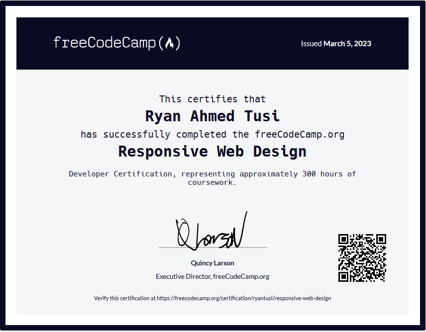

# Welcome to My freeCodeCamp Responsive Web Design Projects! 🌟

This repository showcases a series of **HTML** and **CSS** projects completed as part of the ***freeCodeCamp*** Responsive Web Design certification. Each project demonstrates various aspects of web development, from basic structure and styling to more complex layouts. 🖥️✨

## Projects

1. **Survey Form**
   - **Description**: A simple survey form demonstrating form elements and layout design.
   - **Key Features**: Responsive layout, input validation.
   - 

2. **Tribute Page**
   - **Description**: A tribute page dedicated to a chosen individual, highlighting HTML and CSS skills.
   - **Key Features**: Semantic HTML, CSS styling techniques.
   - 

3. **Technical Documentation Page**
   - **Description**: A technical documentation page illustrating the use of HTML/CSS in technical writing.
   - **Key Features**: Clear navigation, code snippets display.
   - 

4. **Product Landing Page**
   - **Description**: A landing page promoting a product or service with emphasis on layout and design.
   - **Key Features**: Eye-catching layout, call-to-action elements.
   - 

5. **Personal Portfolio Webpage**
   - **Description**: A personal portfolio webpage showcasing your skills and projects.
   - **Key Features**: Showcase section, contact form.
   - 

## Certification

I've earned the [freeCodeCamp Responsive Web Design certification](https://www.freecodecamp.org/certification/ryantusi/responsive-web-design) upon completing these projects. This certification validates proficiency in fundamental web development skills.

Feel free to explore each project by following the links provided above. Your feedback and suggestions are highly appreciated! 🚀🌐
